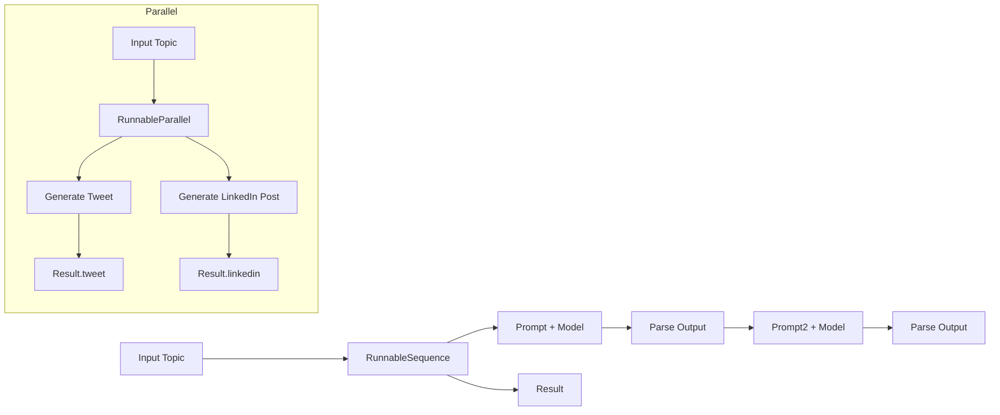

# Runnables Module

This folder demonstrates LangChain `Runnable` primitives for composing AI workflows in a modular, reusable way.

## What is a Runnable?

A `Runnable` in LangChain is a composable unit of work that can be invoked with input and returns output. Runnables let you build AI pipelines by combining prompts, models, parsers, local functions, and branch logic.

### Why use Runnables?

- Build multi-step pipelines cleanly
- Separate prompt or model steps from business logic
- Run multiple tasks in parallel
- Add conditional routing without manual if/else plumbing
- Reuse components across applications

## Core Runnable Types in this folder

### `RunnableSequence`

A sequential pipeline of runnables.

- Each step receives the output of the previous step.
- Ideal for workflows like: prompt & model -> parse -> prompt again -> model -> parse.

Example flow:
1. Generate a joke from a topic
2. Parse the text output into a string
3. Use the joke in a second prompt to explain it

Source file: `runnable_sequence.py`

### `RunnableParallel`

Runs multiple runnables at the same time with the same input.

- Returns a dictionary of outputs keyed by branch name.
- Good for generating several responses in parallel or combining model output with local computations.

Example flow:
- Generate a tweet and a LinkedIn post from the same topic
- Return `{ "tweet": ..., "linkedin": ... }`

Source file: `runnable_parallel.py`

### `RunnablePassthrough`

Returns its input unchanged.

- Useful when you need to carry data forward into a later branch or combine existing values with a new runnable.
- Often used inside a `RunnableParallel` to preserve an earlier result while processing additional outputs.

Source file: `runable_passthrough.py`

### `RunnableLambda`

Wraps a regular Python function as a runnable.

- Lets you include local logic like text analysis, counting, validation, or formatting in the same pipeline as LLM steps.
- Input/Output are passed through functions like normal Python callables.

Example flow:
- Generate a joke with the model
- Run a local `word_count` function on the generated joke
- Return both results together

Source file: `runnable_lambda.py`

### `RunnableBranch`

Chooses one of several runnables based on a condition.

- Useful for conditional workflows where the next step depends on input or an earlier result.
- Can route data to different processing paths, such as summarizing only when a prompt is too long.

Source file: `runnable_branch.py`

> Note: `runnable_branch.py` contains a branching example scaffold. It demonstrates the intended pattern for a conditional `RunnableBranch` and can be completed by supplying a condition function.

## Use cases for Runnables

1. **Multi-step prompt workflows**
   - Cleanly chain prompts, models, and parsers without nested callbacks.
   - Example: generate text, then summarize it, then reformat it.

2. **Parallel content generation**
   - Generate multiple assets from the same input simultaneously.
   - Example: blog title, tweet, and LinkedIn post together.

3. **Hybrid AI + local logic pipelines**
   - Combine model output with Python processing.
   - Example: run a word count, detect sentiment, or validate output after the model returns it.

4. **Conditional behavior**
   - Branch depending on input size, user intent, or earlier results.
   - Example: only summarize if the generated report exceeds a threshold.

5. **Reusability and composition**
   - Build reusable pieces once, then combine them into larger applications.
   - Example: a joke generator runnable can be reused in different higher-level pipelines.

## File-by-file summary

### `runnable_sequence.py`

- Demonstrates `RunnableSequence`
- Workflow:
  1. Prompt for a joke
  2. Invoke the model
  3. Parse the response
  4. Prompt the model again to explain that joke
  5. Parse the explanation

### `runnable_parallel.py`

- Demonstrates `RunnableParallel`
- Workflow:
  - Generate a tweet from `topic`
  - Generate a LinkedIn post from `topic`
  - Run both chains at the same time and print both outputs

### `runnable_lambda.py`

- Demonstrates `RunnableLambda`
- Workflow:
  1. Generate a joke from `topic`
  2. Count words in the joke with a local Python function
  3. Return both the joke and word count

### `runable_passthrough.py`

- Demonstrates `RunnablePassthrough` and `RunnableParallel`
- Workflow:
  1. Generate a joke from `topic`
  2. In parallel, keep the joke and generate an explanation for it
  3. Return both the original joke and the explanation together

### `runnable_branch.py`

- Demonstrates the concept of conditional branching
- Intended workflow:
  1. Generate a report from `topic`
  2. Decide whether to summarize it
  3. Run either a summarization path or no-op path depending on the condition

## Example diagrams



## How to run these examples

1. Activate your Python environment.
2. Install dependencies from the repository root.
3. Set API keys in a `.env` file as needed.
4. Run any example directly, for example:

```bash
python 8.Runnables/runnable_sequence.py
python 8.Runnables/runnable_parallel.py
python 8.Runnables/runnable_lambda.py
python 8.Runnables/runable_passthrough.py
```

## Tips before pushing to GitHub

- Confirm the `ChatGroq` model and API keys are configured in `.env`.
- If `runnable_branch.py` is still a scaffold, add the conditional logic before using it in production.
- Keep this README synced with the runnable files so future maintainers understand the workflow patterns.

---

## Recommended next step

Complete `runnable_branch.py` by adding a real `condition` function and sample branching logic. Then update this README with the exact branch behavior.
