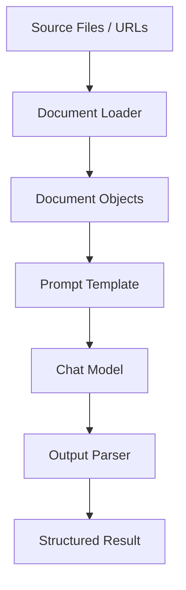

# Document Loaders

This module demonstrates the use of document loaders to ingest textual data into an AI workflow.

## ❓ What is a Document Loader?

A document loader is a utility that reads external content and converts it into a standardized document format that LangChain can process. Loaders handle raw files, URLs, and directories, and they attach metadata to each document so downstream prompts or chains can use the content reliably.

## 💡 Why Document Loaders Matter

- They abstract file reading and parsing logic.
- They normalize content into a standard `Document` object.
- They populate metadata like source path, file name, and page number.
- They make downstream AI workflows easier, cleaner, and more reusable.

## 🧩 Libraries Used

- `langchain_community`: provides community-contributed document loaders like `TextLoader`.
- `langchain_core`: provides prompt templates, output parsers, and runnable composition.
- `langchain_groq`: example ChatGroq model integration for AI inference.
- `python-dotenv`: loads environment variables from a `.env` file.

## ⚙️ How It Works

1. A loader reads input data from a source.
2. The loader returns one or more standardized `Document` objects.
3. The document text is passed into a prompt template.
4. The prompt is invoked with a chat model.
5. The model output is optionally parsed into a final result.

In this folder, `text-loader.py` illustrates that flow with a text file.

## 📄 Current Example: `text-loader.py`

- Uses `TextLoader` to read `cricket_poem.txt`.
- Prints the loaded document content and metadata.
- Builds a simple pipeline:
  - `PromptTemplate`
  - `ChatGroq` model
  - `StrOutputParser`
- Invokes the pipeline with the text content.

## 🗂️ Sample CSV Loader Example
- `csv_loader.py` is built to read `user_data.csv` from the repository root.
- The sample dataset contains 400 synthetic user records and demonstrates how to ingest tabular data.
- Use `CSVLoader` to convert rows into LangChain `Document` objects with metadata.
- Best for learning how to process structured data, not just plain text files.

## 📚 Common Document Loader Types

Below are common loader categories, with examples and typical use cases.

### 1. `TextLoader`

- Reads plain text files (`.txt`).
- Best for simple documents, transcripts, and raw notes.

Example:
```python
from langchain_community.document_loaders import TextLoader
loader = TextLoader("cricket_poem.txt", encoding="utf-8")
documents = loader.load()
```

### 2. `CSVLoader`

- Reads comma-separated values files.
- Useful for structured tabular data and metadata extraction.

### 3. `JSONLoader` / `JSONLLoader`

- Reads JSON or JSON Lines data.
- Ideal for structured documents, chat logs, or API output.

### 4. `PDFLoader`

- Reads PDF files and extracts text.
- Common for reports, manuals, and contracts.

### 5. `UnstructuredFileLoader`

- Supports multiple file types through the `unstructured` package.
- Good for mixed-format ingestion when file types vary.

### 6. `DirectoryLoader`

- Loads all documents from a folder.
- Great for batch ingestion of many files.
- Supports file pattern filtering and nested directory traversal.
- Useful when you have a dataset of mixed document types or a folder for a project corpus.

Common patterns:
- `*.txt` — only text files
- `*.pdf` — only PDF files
- `*.md` — only Markdown files
- `**/*` — all files in the directory and subdirectories

Example:
```python
from langchain_community.document_loaders import DirectoryLoader
loader = DirectoryLoader(
    "./data",
    glob="**/*.txt",
    loader_cls=TextLoader,
    encoding="utf-8"
)
documents = loader.load()
```

When to use `DirectoryLoader`:
- Loading a corpus of meeting notes, transcripts, or articles.
- Preparing a folder of documents for search or question answering.
- Ingesting both source text and associated metadata from the same directory.

Loader behavior by pattern:
- `glob="*.txt"` loads all `.txt` files in one folder.
- `glob="**/*.pdf"` loads PDF files recursively from nested folders.
- `glob="*.md"` loads Markdown documents while skipping binaries.
- `glob="**/*"` can be combined with `loader_cls` logic to handle different file types in the same tree.

The loader also attaches document metadata such as source path, file name, and file type to every `Document` object.

### 7. `WebBaseLoader` / `PlaywrightURLLoader`

- Loads content from web pages or URLs.
- Useful for scraping public webpages or knowledge sources.

## 🏗️ Typical Architecture



## 🚀 Most Common Workflow

1. Choose a loader for your data source.
2. Load documents and inspect metadata.
3. Create a prompt that accepts document text.
4. Send the prompt to the model.
5. Parse or format the model response.

## ✅ When to Use Document Loaders

- Building a retrieval pipeline for search or question answering.
- Preprocessing documents for summarization or extraction.
- Ingesting a collection of files into an LLM workflow.
- Standardizing content from multiple sources before a chain.

## 📝 Notes for GitHub

- This folder is a dedicated demo of document ingestion.
- Keep the README synced with the example scripts.
- Add new loader examples as you expand to PDF, CSV, JSON, or web content.

---

## ▶️ Recommended Next Step

Add additional loader examples such as `PDFLoader`, `CSVLoader`, and `DirectoryLoader` to make this module a complete document ingestion reference.
