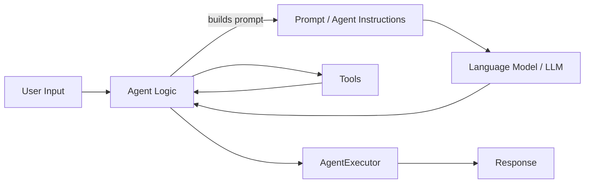
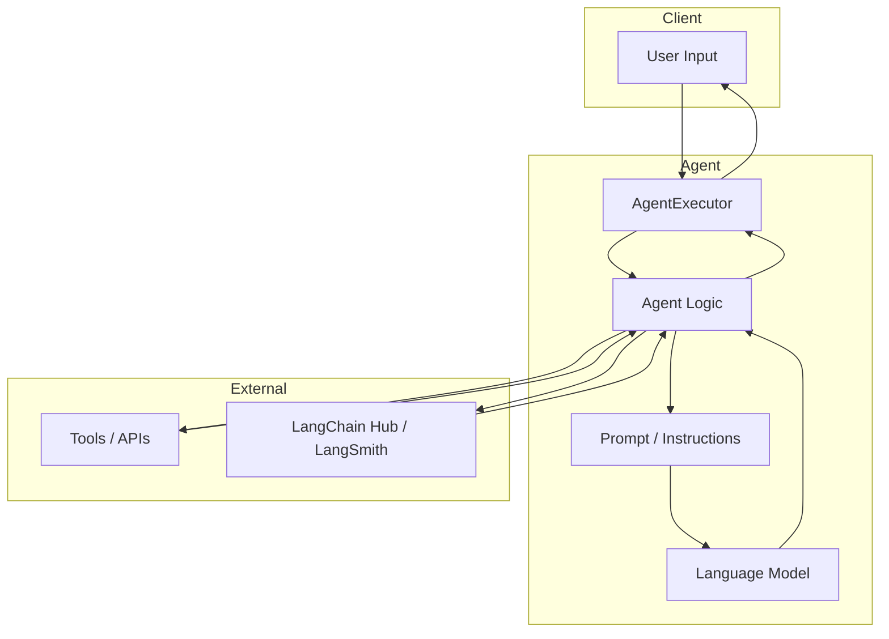

# AI Agent LangChain

This folder contains notebooks and examples demonstrating agent-based workflows with LangChain, including how to pull prompts from a hub, build React-style agents, and execute them using `AgentExecutor`.

## Contents

- `agents-in-langchain.ipynb` — Example notebook for loading agents from LangChain Hub and constructing an agent workflow.
- `weather-agent.ipynb` — Example notebook focused on a weather query agent.

## Agent Overview

An **agent** is an orchestration layer around a language model that can call tools, manage state, and route conversations or tasks. Agents are useful when you want the model to:

- choose between tools dynamically
- reason about multi-step tasks
- execute actions based on external data or APIs

In LangChain, an agent typically consists of:

- a language model (`LLM`) like OpenAI, Gemini, or Groq
- tools that the agent can call
- a prompt template or instructions
- a decision-making loop that chooses the next action

## React Agents

A **React agent** is a pattern for agent design inspired by the React framework model of components and state. In LangChain contexts, this means:

- separating logic into reusable components
- composing actions and tool calls dynamically
- keeping `prompt` and action selection clean and declarative

React agents are best when you want a structured flow with clear responsibilities, such as:

- parsing user intent
- selecting the right tool
- generating a response
- updating internal state

## Agent Flow

The typical flow for an agent-based notebook in this folder is:

1. Load environment variables and API keys
2. Initialize the language model (`LLM`)
3. Create tool wrappers (search, weather, API calls, etc.)
4. Pull or define the prompt / agent instructions
5. Build the agent using the prompt and tools
6. Wrap the agent with `AgentExecutor`
7. Execute the agent on input and collect the result

## AgentExecutor

`AgentExecutor` is the runtime wrapper that executes the agent loop. It uses the defined agent and available tools to:

- manage the sequence of prompts and actions
- call tools when needed
- accumulate intermediate reasoning
- return a final response

This makes the agent execution repeatable and easy to debug.

## Architecture Flow

The architecture for an agent workflow in this folder can be represented as:

## Suggested Architecture Diagram

## Important Notes About LangGraph

`LangGraph` is a graph-based orchestration system for LangChain flows. Key points:

- It enables building directed graphs of prompts, tools, and transformations.
- Each node in the graph can represent an LLM call, a tool invocation, or a data transformation.
- Graph flows are useful for complex multi-step reasoning, branching workflows, and reusable pipelines.
- LangGraph helps visualize and debug the flow of information through an AI application.

### Why LangGraph matters

- improves transparency by making each step explicit
- supports modular and composable AI workflows
- simplifies integration between prompt generation and external tool execution
- makes it easier to maintain and extend agent-based applications

## Best Practices

- Always validate the hub repo path before using `hub.pull(...)`.
- Keep prompts modular and reusable.
- Use `AgentExecutor` to wrap the agent logic for consistent execution.
- Prefer clear tool interfaces so the agent can reason about available actions.
- Document the flow and architecture in a README like this one.

## Getting Started

1. open the notebooks in `Ai-Agent-Langchain`
2. ensure API keys are set in `.env`
3. run the agent examples step by step
4. replace invalid hub repo references with valid LangChain Hub paths

---

This README is designed to help you understand agent concepts, React-style agents, runtime execution, and important LangGraph ideas for building well-structured workflows.